# QA Automation Project - Cypress + Postman

[](https://github.com/guilhermedalbuquerque/QA-Automation-Project---Cypress-Postman/actions)

Projeto de automação de testes focado em **API Testing**, utilizando **Cypress** para automação e **Postman** para validação e documentação de endpoints, com execução automatizada em **CI/CD (GitHub Actions)**.

---

## Tecnologias utilizadas

* JavaScript (Node.js)
* Cypress
* Postman
* GitHub Actions (CI/CD)

---

## Estrutura do Projeto

```
qa-cypress-project/
│
├── cypress/
│   ├── e2e/
│   ├── support/
│   │   ├── commands.js
│   │   └── e2e.js
│
├── docs/
│   ├── cypress/
│   ├── postman/
│   └── structure/
│
├── cypress.config.js
├── package.json
└── .env
```

---

## Conceitos aplicados

* Testes automatizados de API com Cypress
* Testes manuais e automatizados com Postman
* Uso de variáveis de ambiente
* Testes positivos e negativos
* Estruturação de testes (CRUD completo)
* Custom Commands no Cypress
* Integração contínua (CI/CD)

---

## Variáveis de ambiente

Crie um arquivo `.env`:

```
API_KEY=your_api_key_here
```

---

## Como rodar o projeto

Instalar dependências:

```
npm install
```

Rodar Cypress em modo interativo:

```
npx cypress open
```

Rodar em modo headless:

```
npx cypress run
```

---

# Testes com Cypress

Testes automatizados cobrindo o fluxo completo de API:

---

### Create User (POST)

* Valida status 201
* Valida retorno do payload

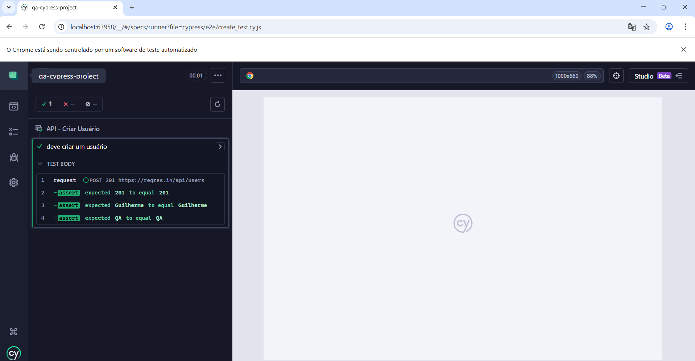

---

### Get Users (GET)

* Valida status 200
* Valida estrutura da resposta
* Valida lista de usuários

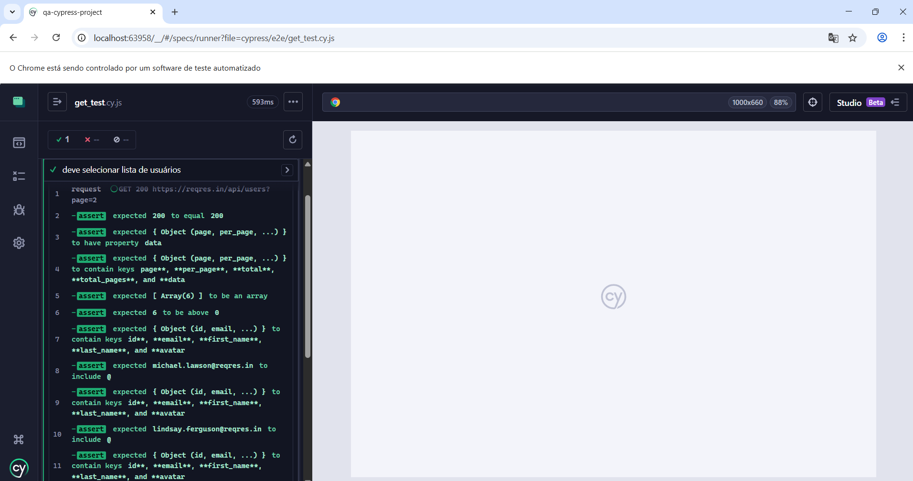

---

### Update User (PUT)

* Valida status 200
* Valida alteração dos dados

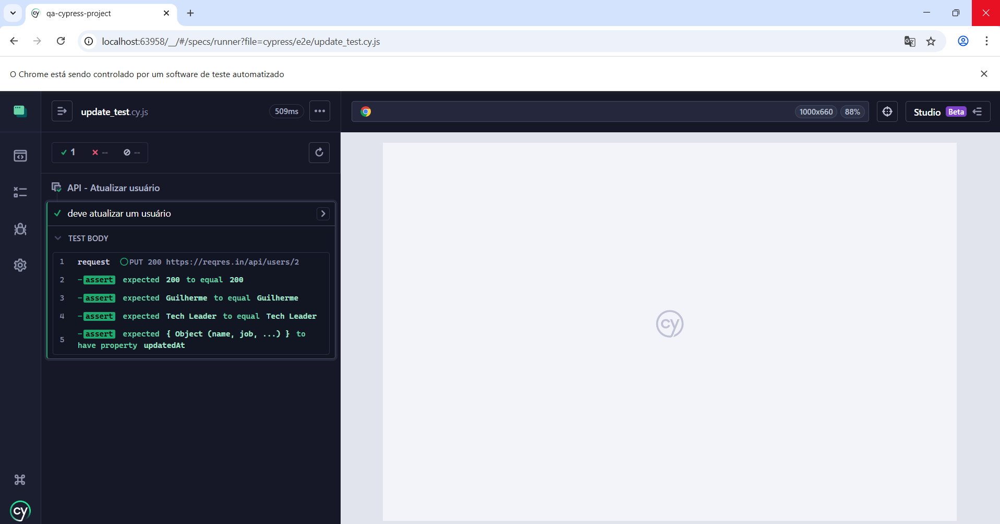

---

### Delete User (DELETE)

* Valida status 204

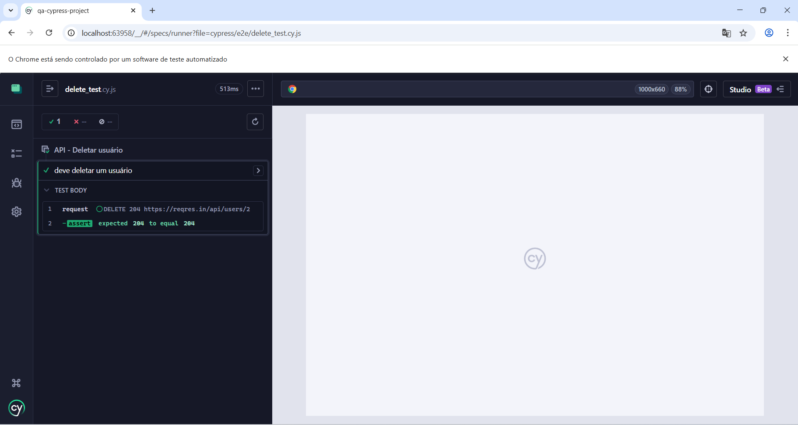

---

### Teste Negativo

* Requisição sem API Key
* Valida erro 401


---

### Execução dos testes

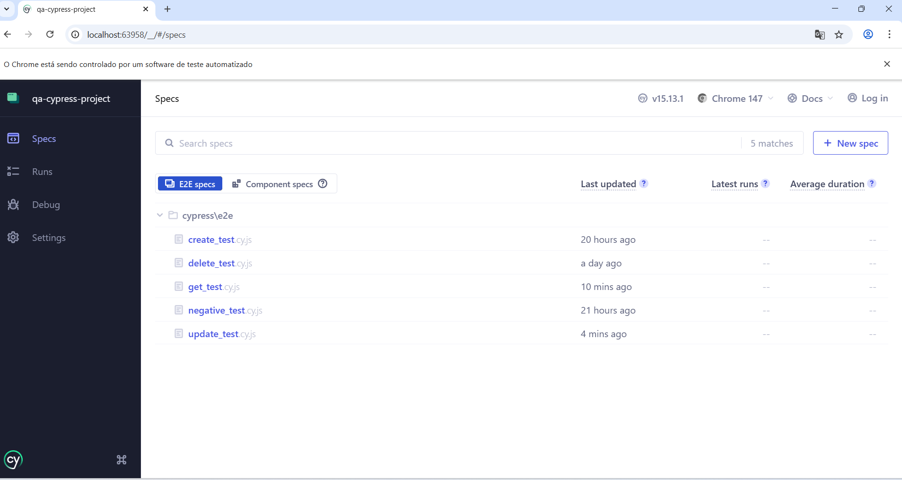

---

# Testes com Postman

Validação manual e automatizada dos endpoints da API.

---

### Environment configurado

Uso de variáveis para base_url e API_KEY


---

### POST - Criar usuário

* Body da requisição
* Validação de resposta
* Scripts de teste

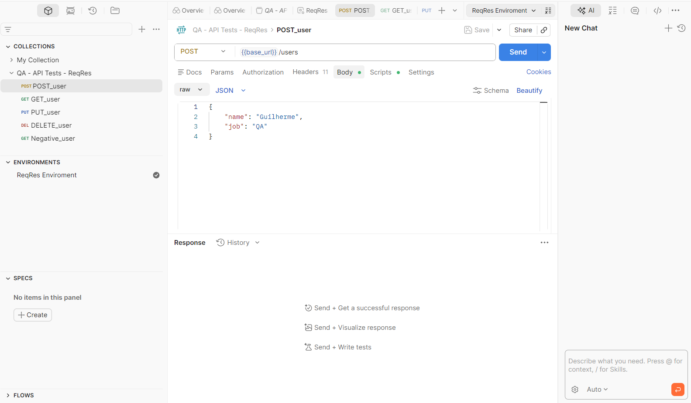
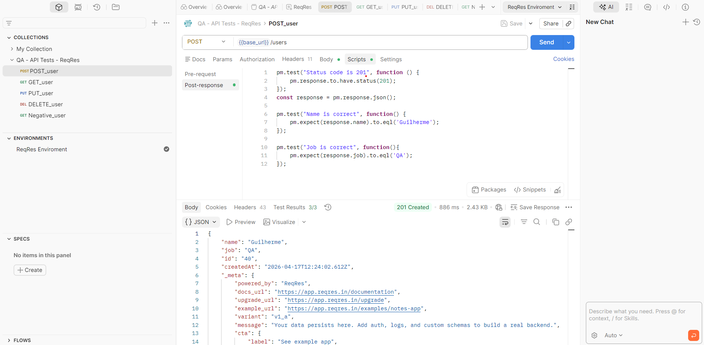
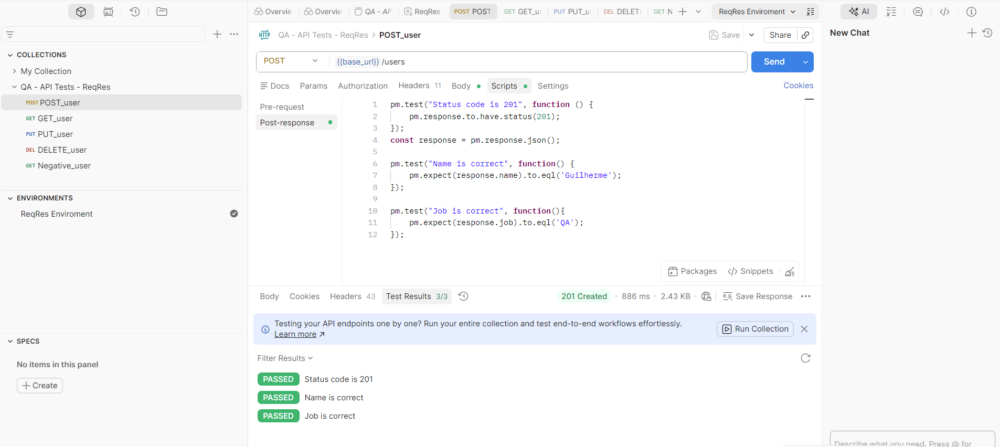

---

### GET - Listar usuários

* Validação de estrutura
* Validação de lista

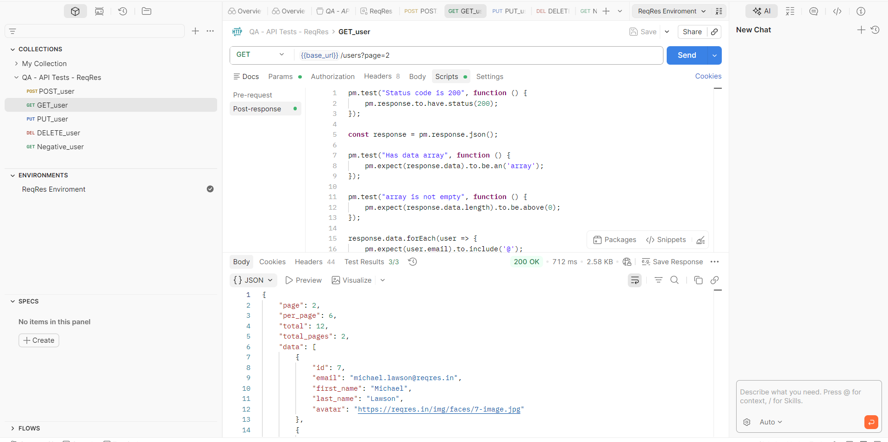

---

### PUT - Atualizar usuário

* Alteração de dados
* Validação da resposta

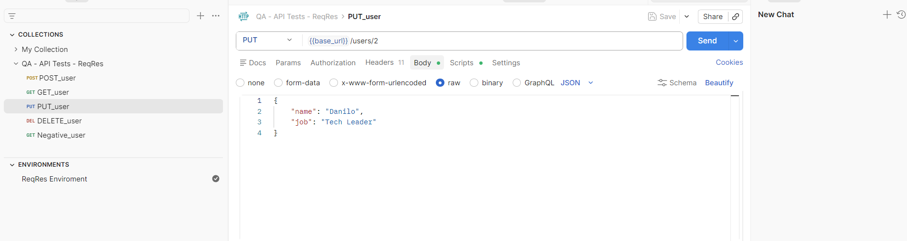
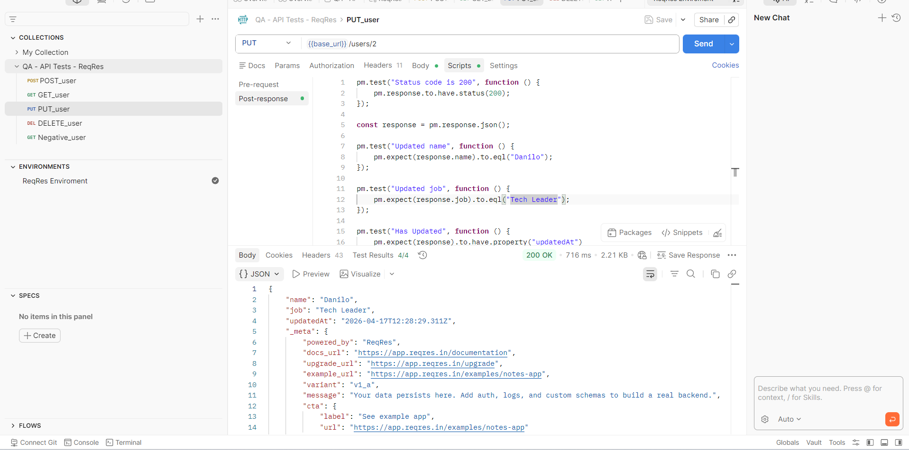

---

### DELETE - Remover usuário

* Validação de status 204

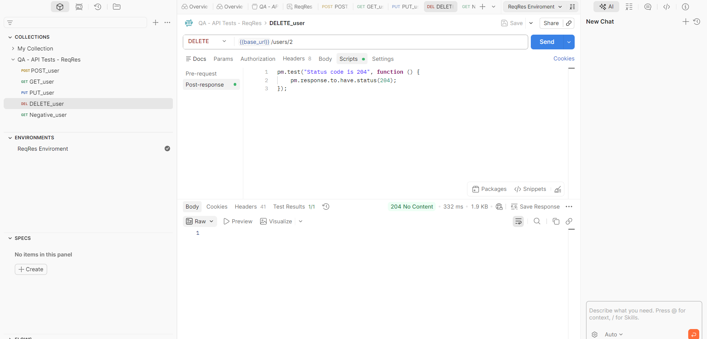

---

### ✔ Teste Negativo

* Requisição sem API Key
* Validação de erro

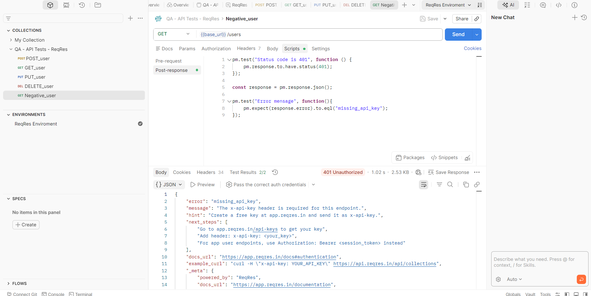

---

# Estrutura do Projeto

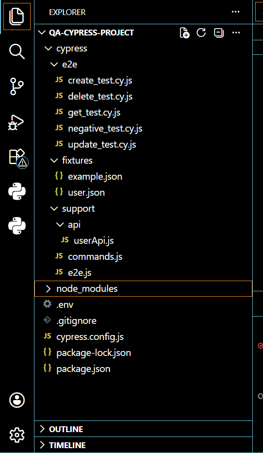

---

# CI/CD com GitHub Actions

Pipeline automatizado responsável por:

* Instalar dependências do projeto
* Executar testes automatizados com Cypress
* Garantir qualidade do código a cada alteração

---

## Disparado em:

* Push
* Pull Request

---

## Exemplo do Workflow

```
name: Cypress Tests

on:
  push:
  pull_request:

jobs:
  cypress-run:
    runs-on: ubuntu-latest

    steps:
      - name: Checkout do código
        uses: actions/checkout@v4

      - name: Instalar Node
        uses: actions/setup-node@v4
        with:
          node-version: 18

      - name: Instalar dependências
        run: npm install

      - name: Rodar testes Cypress
        run: npx cypress run
```

---

# Diferenciais do projeto

- Integração Cypress + Postman
- Cobertura completa de CRUD
- Testes positivos e negativos
- Uso de variáveis de ambiente
- Organização profissional de documentação
- Uso de custom commands
- Execução automatizada em CI/CD

---

# Autor

Guilherme de Albuquerque Silva Azevedo

---

# Observações

Projeto desenvolvido com foco em simular um ambiente real de testes de API, combinando automação com Cypress e validações estruturadas no Postman, seguindo boas práticas de QA, automação e integração contínua.
